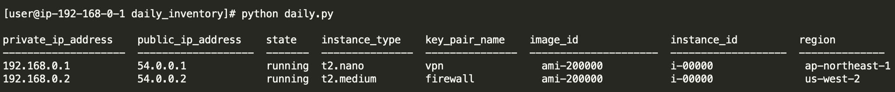

This script outputs a tabular view of all instances across all regions in an AWS account. It was written to be run on an instance utilizing a role.

To get started, you'll need the following:
  * pip install -r requirements.txt
  * IAM Role with AmazonEC2ReadOnlyAccess
  * EC2 Instance (used a t2.nano) with IAM Role in previous step
  * A good ole copy of the main.py script in this repository
  
If everything is set correctly...and I didn't forget anything... run the miner... I mean script.
  
